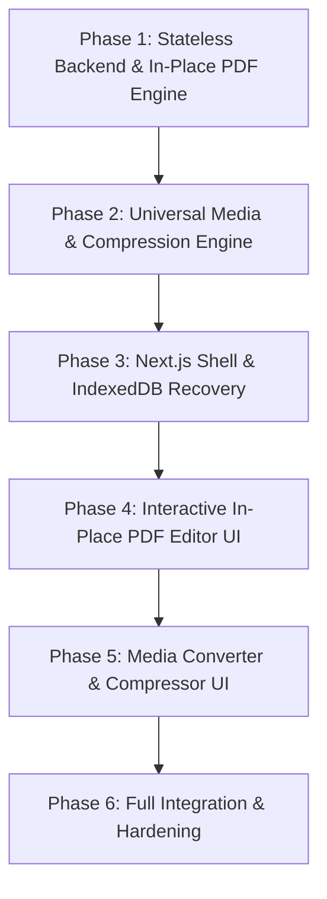

# Roadmap: OmniMedia & PDF Studio

## Overview
This roadmap organizes the development of the OmniMedia & PDF Studio into modular, testable phases following the GSD tracer-first delivery methodology.

---

## Phase Breakdown

### Phase 1: Stateless Backend & In-Place PDF Engine
**Goal**: Build the FastAPI stateless server, ephemeral file sandbox, and PyMuPDF-based in-place text replacement engine that matches fonts, baselines, and colors seamlessly.
- Set up Python virtual environment and dependencies (`fastapi`, `uvicorn`, `pymupdf`, `fonttools`, `python-multipart`, `pytest`).
- Implement ephemeral sandbox manager with automated background cleanup (timeout and post-download deletion).
- Implement `InPlacePDFEditor`:
  - Detailed font analysis (family, weight, point size, color, baseline origin, matrix).
  - Precision in-place text replacement (redact target bounding box and re-insert replacement text using exact font metrics and alignment).
- Implement PDF core operations: merge, split/burst, page rotation, and high-res thumbnail rendering.
- **Verification**: Unit tests proving seamless text replacement, exact coordinate matching, and temp file cleanup.

### Phase 2: Universal Media & Compression Engine
**Goal**: Build universal audio/video conversion and smart compression pipelines powered by FFmpeg and modern image algorithms.
- Verify and integrate system `ffmpeg` & `ffprobe`.
- Implement `AudioConversionService`: transcode across `MP3`, `WAV`, `AAC`, `FLAC`, `OGG`, `M4A`.
- Implement `VideoConversionService`: transcode across `MP4`, `MKV`, `AVI`, `WEBM`, `MOV` with resolution presets.
- Implement `ImageConversionService`: Images to PDF, PDF to PNG/JPG/WEBP/SVG, and HEIC input support.
- Implement `SmartCompressorService`:
  - Images: WebP/MozJPEG/OxiPNG lossless & high-efficiency compression.
  - Media: FFmpeg CRF-based encoding (H.264/H.265/VP9) and audio bitrate optimization.
- **Verification**: Integration tests validating conversion fidelity and compression savings across formats.

### Phase 3: Next.js Shell & IndexedDB Recovery
**Goal**: Scaffold the Next.js frontend with premium ultra-modern UI, intelligent multi-format file staging, and IndexedDB auto-recovery.
- Initialize Next.js project with TypeScript, modern design tokens, and sleek typography.
- Implement `IndexedDBService`:
  - Save staged files, document blobs, and active edit state locally.
  - Implement 2–4 hour TTL check and automatic garbage collection of expired sessions.
  - Session auto-recovery banner/modal on app reload (*"Restore your previous work?"*).
- Build the unified drag-and-drop workspace capable of auto-detecting file types (PDF, Image, Audio, Video) and displaying appropriate tool actions.
- **Verification**: Unit & browser tests verifying IndexedDB persistence, reload recovery, and TTL eviction.

### Phase 4: Interactive In-Place PDF Editor UI
**Goal**: Build the interactive PDF editing canvas in Next.js for clicking and editing text directly on document pages.
- Render PDF pages with high-fidelity canvas overlay.
- Text selection layer: detect text spans on hover/click, display matched font specs (font, size, color).
- Inline editing modal / overlay: type replacement text and preview live font styling.
- Multi-page workspace: page reorder, rotation handles, page deletion, and split range selector.
- Connect to Phase 1 backend endpoints for processing and downloading edited PDFs.
- **Verification**: Visual audit verifying indistinguishable in-place text replacement in browser.

### Phase 5: Media Converter & Compressor UI
**Goal**: Build dedicated converter and smart compressor interfaces with real-time feedback and download management.
- Universal Converter views:
  - Audio: format picker, bitrate/sample rate controls.
  - Video: format picker, resolution scaling presets.
  - Image & PDF: format picker, page-to-image or image-to-PDF options.
- Smart Compressor view:
  - Quality presets (Lossless, High Quality, Maximum Compression).
  - Side-by-side or before/after size comparisons with percentage saved badges.
- Batch processing list with progress bars, status indicators, and one-click ZIP or direct downloads.
- **Verification**: End-to-end tests converting and compressing test audio, video, and image files.

### Phase 6: Full Integration, Security & Hardening
**Goal**: Comprehensive integration, security auditing, edge-case handling, and production readiness.
- End-to-end testing of all user journeys without authentication hurdles.
- Stress testing: large files (>50MB video, 100+ page PDFs, multi-image batches).
- Security audit: filename sanitization, command injection protection for FFmpeg, path traversal checks.
- API documentation, environment configuration, and startup scripts.
- **Verification**: Complete test suite pass, zero console errors, zero orphan files left on backend.
