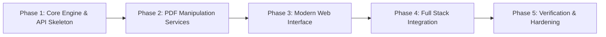

# Roadmap: PDF Toolkit

## Overview
This roadmap organizes the development of the PDF Toolkit into sequential, testable phases following the GSD tracer-first delivery methodology.

---

## Phase Breakdown

### Phase 1: Core Engine & API Skeleton
**Goal**: Establish the Python FastAPI application architecture, environment dependencies, and foundational PyMuPDF engine for document validation, metadata extraction, and thumbnail rendering.
- Set up Python virtual environment, dependencies (`fastapi`, `uvicorn`, `pymupdf`, `pytest`, `python-multipart`).
- Implement core `PDFEngine` service with methods for opening, validating, and extracting metadata.
- Implement thumbnail generation service (render PDF page to PNG in-memory).
- Build initial health check and upload verification API endpoints.
- **Verification**: Unit tests validating PDF loading, invalid file rejection, and thumbnail rendering.

### Phase 2: PDF Manipulation Services
**Goal**: Implement and verify all backend manipulation algorithms and their respective REST endpoints.
- Merge service: combine multiple input PDFs into a single file with custom ordering.
- Split & Extract service: extract page ranges or split into individual pages (ZIP export).
- Organize service: page rotation (90°/180°/270°), deletion, and re-sequencing.
- Compress service: stream optimization and garbage collection via PyMuPDF.
- REST endpoints for each operation with temporary file lifecycle management.
- **Verification**: Automated test suite for each operation comparing input vs output PDF structures.

### Phase 3: Modern Web Interface
**Goal**: Design and build the frontend interface with rich aesthetics, drag-and-drop file upload, thumbnail grid, and operation controls.
- Design system: custom CSS tokens, modern typography, glassmorphism accents, responsive layouts.
- Staging component: multi-file drag-and-drop zone with file list, size badges, and remove actions.
- Document workspace: visual page thumbnail grid with page numbers, selection checkboxes, and rotation handles.
- Operation controls: tabbed panel for Merge, Split, Organize, and Compress actions.
- Status feedback: progress bars, spinners, and toast notifications.
- **Verification**: Browser visual audit and layout testing.

### Phase 4: Full Stack Integration
**Goal**: Wire the web frontend to the FastAPI backend with seamless async execution and download handling.
- Asynchronous API client for file uploads and operation execution.
- Live thumbnail loading from backend rendering endpoint.
- Direct binary file download triggers for processed PDFs and ZIP files.
- Comprehensive error handling: client-side validation and backend error toasts.
- Automated cleanup of temporary staging and output files.
- **Verification**: Complete end-to-end user workflows (upload -> edit/merge/split -> download).

### Phase 5: Verification & Hardening
**Goal**: Edge case testing, performance profiling, security checks, and production readiness.
- Large document stress tests (100+ pages, large file sizes).
- Corrupted file and memory leak resilience checks.
- API security audit (input validation, path traversal prevention in temp files).
- Documentation (README, API docs, usage guide).
- **Verification**: Full test suite pass and UAT verification.
